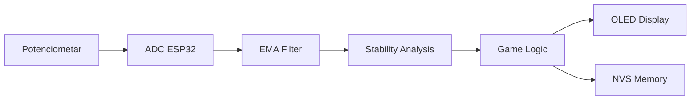
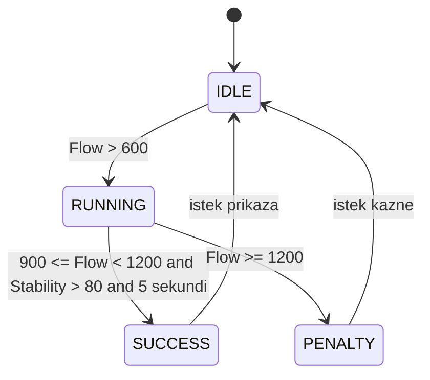

# Izvještaj projekta BalloonBreath

## Kolegij

Računalni ugrađeni sustavi (RUS)

## Projekt

BalloonBreath – IoT digitalni spirometar temeljen na ESP32 platformi

## Autori

- Petra Štirjan
- Patrik Ostrunić

---

# Sažetak

BalloonBreath predstavlja digitalnu simulaciju medicinskog poticajnog spirometra razvijenu na ESP32 mikrokontrolerskoj platformi. Sustav koristi potenciometar kao emulator protoka zraka te OLED zaslon za prikaz respiratorne vježbe u obliku interaktivne igre s balonom na vrući zrak.

Cilj korisnika je održavati simulirani protok zraka unutar medicinski definirane zone od 900 ml/s do 1200 ml/s tijekom minimalno pet sekundi uz zadržavanje stabilnog disanja. Sustav implementira filtriranje signala, procjenu stabilnosti, numeričku integraciju volumena te pohranu najboljeg rezultata u trajnu memoriju ESP32 mikrokontrolera.

Projekt zadovoljava sve obvezne zahtjeve zadatka te implementira dodatne napredne funkcionalnosti propisane projektnom dokumentacijom.

---

# 1. Uvod

## 1.1 Motivacija

Respiratorna rehabilitacija predstavlja važan dio oporavka pacijenata nakon:

- kirurških zahvata
- respiratornih bolesti
- dugotrajne hospitalizacije
- smanjene plućne funkcije

Jedan od najčešće korištenih uređaja za rehabilitaciju je Incentive Spirometer.

Klasični spirometar koristi tri kuglice koje se podižu ovisno o protoku zraka koji korisnik ostvaruje tijekom udaha.

Budući da laboratorijsko okruženje ne omogućava korištenje profesionalnih senzora protoka, u ovom projektu koristi se potenciometar kao emulator respiratornog protoka.

---

## 1.2 Problem

Tradicionalni spirometri koriste mehanički prikaz koji nije posebno zanimljiv korisniku.

Zbog toga je odlučeno razviti alternativno korisničko sučelje koje:

- zadržava medicinsku logiku
- zadržava identične pragove protoka
- pruža intuitivniji vizualni prikaz
- povećava motivaciju korisnika

---

## 1.3 Rješenje

Razvijena je igra BalloonBreath.

U igri:

- balon predstavlja respiratorni napor
- visina balona predstavlja protok zraka
- Coach Indicator predstavlja stabilnost disanja
- sigurna zona predstavlja optimalan terapijski raspon

---

# 2. Analiza zahtjeva

## 2.1 Obvezni zahtjevi

Prema projektnom zadatku sustav mora omogućiti:

| Zahtjev | Implementacija |
|----------|----------|
| Periodičko očitavanje potenciometra | ADC ESP32 |
| Neblokirajući rad | millis() |
| Filtriranje signala | EMA |
| OLED prikaz | SSD1306 |
| Logika vježbe | State Machine |
| Uspjeh/neuspjeh | SUCCESS/PENALTY |
| Vizualni prikaz | Balon |
| Coach Indicator | Implementiran |
| Dokumentacija | GitHub Wiki |

---

## 2.2 Napredne funkcije

Projekt implementira dvije napredne funkcije:

### Numerička integracija volumena

Računanje ukupnog volumena udaha.

### NVS memorija

Pohrana najboljeg rezultata između resetiranja uređaja.

---

# 3. Hardverska arhitektura

## 3.1 Komponente

| Komponenta | Opis |
|------------|------------|
| ESP32 DevKit V4 | Glavni mikrokontroler |
| OLED SSD1306 | Grafički prikaz |
| Potenciometar | Emulator protoka |

---

## 3.2 ESP32

ESP32 je odabran zbog:

- 12-bitnog ADC-a
- velikog broja GPIO pinova
- ugrađene WiFi podrške
- NVS memorije
- dovoljne procesorske snage

---

## 3.3 OLED zaslon

Karakteristike:

| Parametar | Vrijednost |
|------------|------------|
| Rezolucija | 128 × 64 px |
| Sučelje | I2C |
| Adresa | 0x3C |
| SDA | GPIO21 |
| SCL | GPIO22 |

---

## 3.4 Potenciometar

Potenciometar simulira:

Q(t)

odnosno trenutni protok zraka.

ADC raspon:

0 – 4095

Mapiranje:

0 – 1400 ml/s

---

# 4. Arhitektura sustava

## 4.1 Blok dijagram




# 6. Upravljanje stanjima sustava

Za implementaciju logike vježbe korišten je model konačnog automata (Finite State Machine).

Takav pristup omogućava:

- jednostavnije održavanje programa
- pregledniju implementaciju
- lakše testiranje
- jasnu podjelu funkcionalnosti

---

## 6.1 Stanja sustava

| Stanje | Opis |
|----------|----------|
| IDLE | Sustav čeka početak vježbe |
| RUNNING | Aktivna respiratorna vježba |
| SUCCESS | Uspješno završena vježba |
| PENALTY | Vježba poništena zbog prevelikog protoka |

---

## 6.2 Dijagram stanja



---

## 6.3 Stanje IDLE

Početno stanje sustava.

U ovom stanju:

- sustav očitava potenciometar
- prikazuje početni ekran
- čeka da protok prijeđe 600 ml/s

Prijelaz u RUNNING stanje:

```cpp
if(currentFlow > THRESHOLD_1)
{
    currentState = RUNNING;
}
```

---

## 6.4 Stanje RUNNING

Aktivna respiratorna vježba.

Sustav:

- prati protok
- računa volumen
- prati stabilnost
- mjeri trajanje vježbe

Ako su zadovoljeni svi uvjeti:

- protok ≥ 900 ml/s
- protok < 1200 ml/s
- stabilnost > 80

pokreće se mjerenje vremena.

---

## 6.5 Stanje SUCCESS

Aktivira se nakon uspješno održane vježbe.

Uvjeti:

- protok između 900 i 1200 ml/s
- stabilnost > 80
- trajanje ≥ 5 sekundi

Sustav:

- prikazuje SUCCESS poruku
- sprema rekord ako je ostvaren novi najbolji rezultat
- nakon nekoliko sekundi vraća se u IDLE stanje

---

## 6.6 Stanje PENALTY

Aktivira se kada:

Flow ≥ 1200 ml/s

što simulira:

- prenagli udah
- turbulenciju zraka
- medicinski neispravno izvođenje vježbe

Sustav:

- poništava pokušaj
- resetira mjerenje
- prikazuje poruku upozorenja

---

# 7. Coach Indicator

## 7.1 Medicinska pozadina

Klasični Incentive Spirometer sadrži indikator koji korisniku pokazuje kvalitetu udaha.

Njegova funkcija je:

- održavanje laminarnog toka zraka
- sprječavanje naglih oscilacija
- poboljšanje kvalitete respiratorne terapije

---

## 7.2 Implementacija u projektu

Coach Indicator prikazan je kao vertikalna traka na OLED zaslonu.

Sastoji se od:

- vanjskog okvira
- ciljne zone
- pomičnog indikatora

---

## 7.3 Izračun

Prvo se računa promjena protoka:

```cpp
diff = abs(currentFlow - prevFlow);
```

zatim:

```cpp
stability = 100 - diff / 4;
```

Vrijednost se ograničava:

```cpp
0 <= stability <= 100
```

---

## 7.4 Interpretacija

| Stability | Značenje |
|------------|------------|
| 90 – 100 | Vrlo stabilan udah |
| 80 – 90 | Dobar udah |
| 60 – 80 | Umjerena nestabilnost |
| < 60 | Loša kontrola protoka |

---

# 8. OLED korisničko sučelje

## 8.1 Prikaz podataka

OLED zaslon prikazuje:

| Element | Opis |
|----------|----------|
| BalloonBreath | Naziv projekta |
| Record | Najbolji volumen |
| Flow | Trenutni protok |
| Coach Indicator | Stabilnost |
| Balloon | Vizualizacija disanja |
| Volume | Ukupni volumen |
| Status | Trenutno stanje |

---

## 8.2 Prikaz balona

Balon predstavlja protok zraka.

Mapiranje:

| Protok | Visina |
|----------|----------|
| 0 ml/s | Najniža pozicija |
| 1400 ml/s | Najviša pozicija |

---

## 8.3 Sigurna zona

Medicinska zona prikazana je unutar okvira.

Predstavlja raspon:

900 ml/s – 1200 ml/s

Korisnik mora održavati balon unutar tog područja.

---

## 8.4 Statusne poruke

| Poruka | Značenje |
|----------|----------|
| READY | Sustav čeka početak |
| H:x.x | Odbrojavanje vremena |
| SUCCESS | Uspješna vježba |
| FAST! | Prevelik protok |

---

# 9. Testiranje sustava

## 9.1 Ciljevi testiranja

Provjeriti:

- ispravnost ADC očitanja
- EMA filtriranje
- izračun volumena
- logiku vježbe
- spremanje rekorda
- prikaz na OLED zaslonu

---

## 9.2 Test 1 – ADC

### Postupak

Rotiranje potenciometra od minimuma do maksimuma.

### Očekivani rezultat

ADC:

0 – 4095

### Rezultat

✓ Uspješno

---

## 9.3 Test 2 – Filtriranje

### Postupak

Nagla promjena potenciometra.

### Očekivani rezultat

Postupna promjena prikaza.

### Rezultat

✓ Uspješno

---

## 9.4 Test 3 – SUCCESS stanje

### Postupak

Održavanje protoka:

900 – 1200 ml/s

dulje od 5 sekundi.

### Rezultat

✓ SUCCESS prikazan

---

## 9.5 Test 4 – PENALTY stanje

### Postupak

Protok > 1200 ml/s

### Rezultat

✓ PENALTY aktiviran

---

## 9.6 Test 5 – NVS memorija

### Postupak

Ostvariti rekord.

Resetirati ESP32.

### Rezultat

✓ Rekord ostaje spremljen

---

# 10. Rezultati

Projekt uspješno ostvaruje sve zahtjeve projektnog zadatka.

Implementirane funkcionalnosti:

✓ očitavanje potenciometra

✓ filtriranje signala

✓ Coach Indicator

✓ numerička integracija volumena

✓ OLED prikaz

✓ logika uspjeha i neuspjeha

✓ NVS pohrana

✓ neblokirajući rad

✓ alternativni scenarij BalloonBreath

---

# 11. Rasprava

Najveći izazovi tijekom razvoja bili su:

- odabir EMA koeficijenta
- definiranje stabilnosti
- dizajn korisničkog sučelja
- usklađivanje medicinskih zahtjeva s igrifikacijom

EMA koeficijent od 0.20 pokazao se kao optimalan kompromis između:

- brzine odziva
- stabilnosti prikaza

Coach Indicator omogućio je dodatnu procjenu kvalitete udaha koja nije vezana samo uz jačinu protoka.

---

# 12. Moguća proširenja

Projekt se može dodatno unaprijediti:

- WiFi povezivanjem
- MQTT komunikacijom
- slanjem podataka liječniku
- web aplikacijom
- mobilnom aplikacijom
- grafovima napretka pacijenta
- pravim senzorom diferencijalnog tlaka

---

# 13. Zaključak

BalloonBreath predstavlja uspješnu implementaciju digitalnog spirometra na ESP32 platformi.

Projekt demonstrira:

- obradu analognih signala
- digitalno filtriranje
- upravljanje stanjima
- numeričku integraciju
- rad s OLED zaslonom
- trajnu pohranu podataka

Korištenjem scenarija balona na vrući zrak ostvarena je zanimljiva i intuitivna vizualizacija respiratorne terapije, pri čemu su svi medicinski pragovi i uvjeti iz izvornog spirometra ostali očuvani.

Projekt zadovoljava sve obvezne i dio naprednih zahtjeva projektnog zadatka te predstavlja uspješnu demonstraciju primjene ugrađenih sustava u području digitalne zdravstvene tehnologije.
